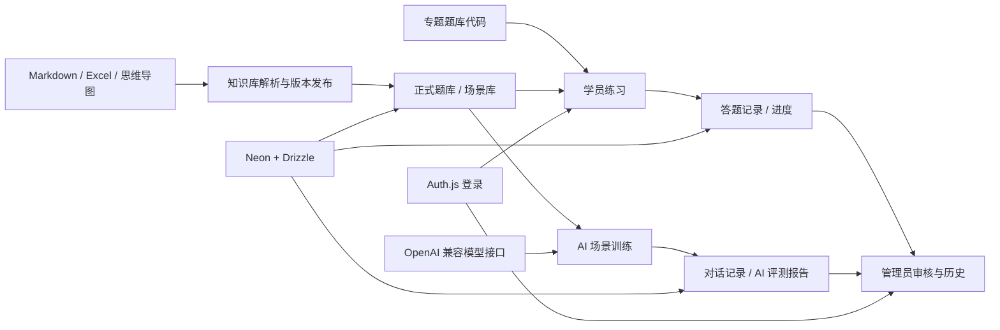
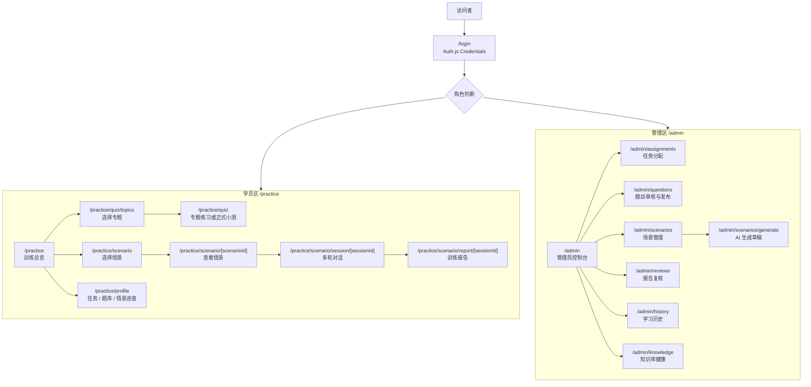
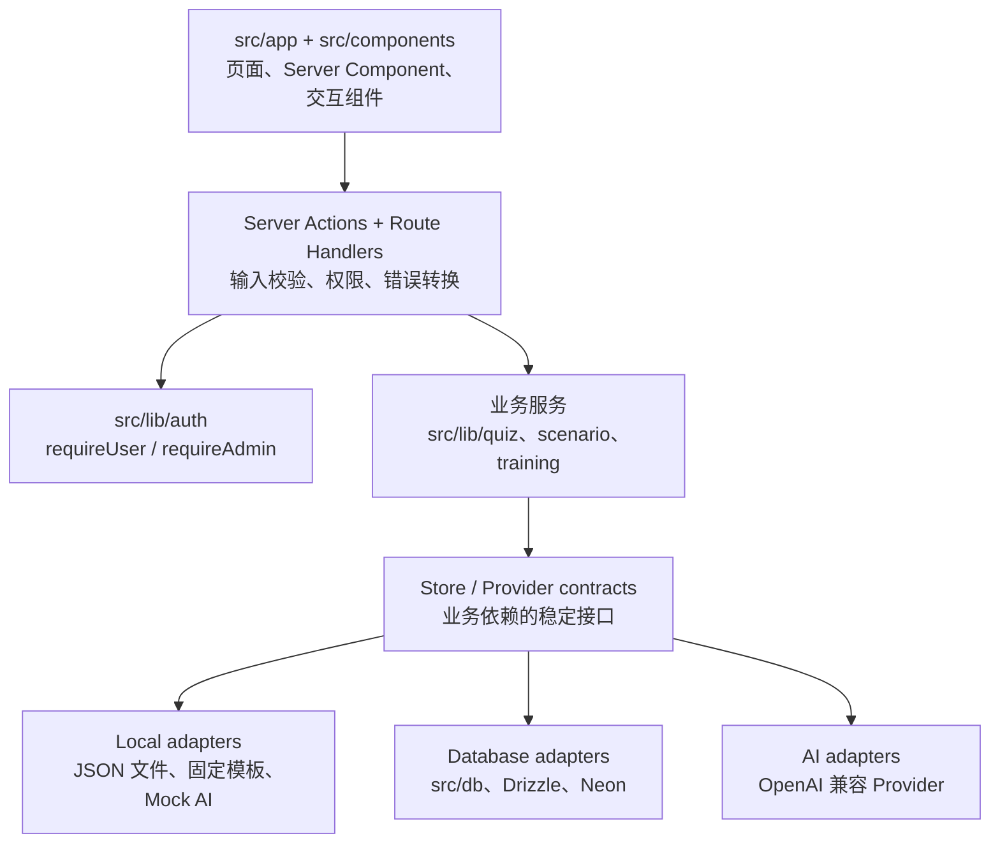
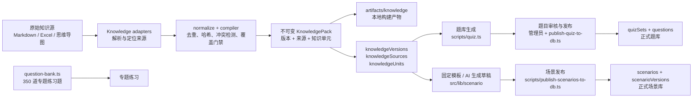
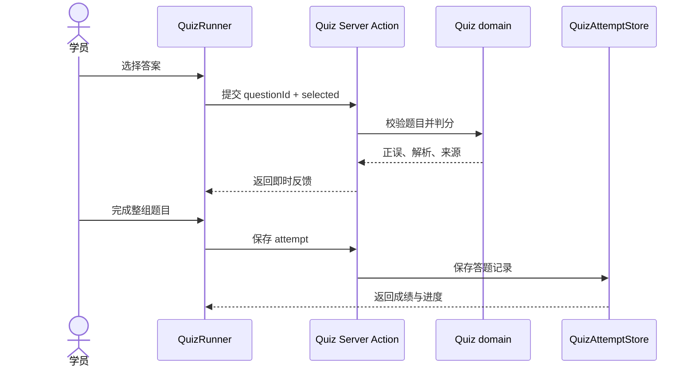
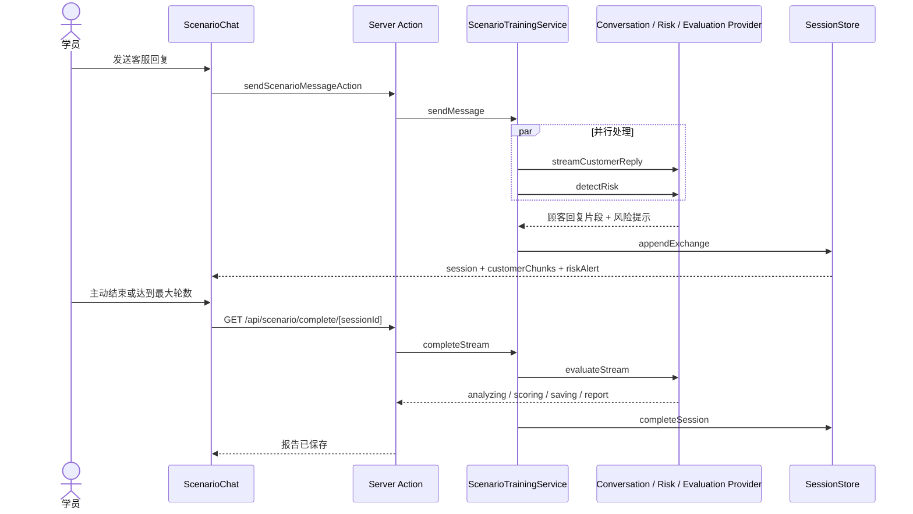
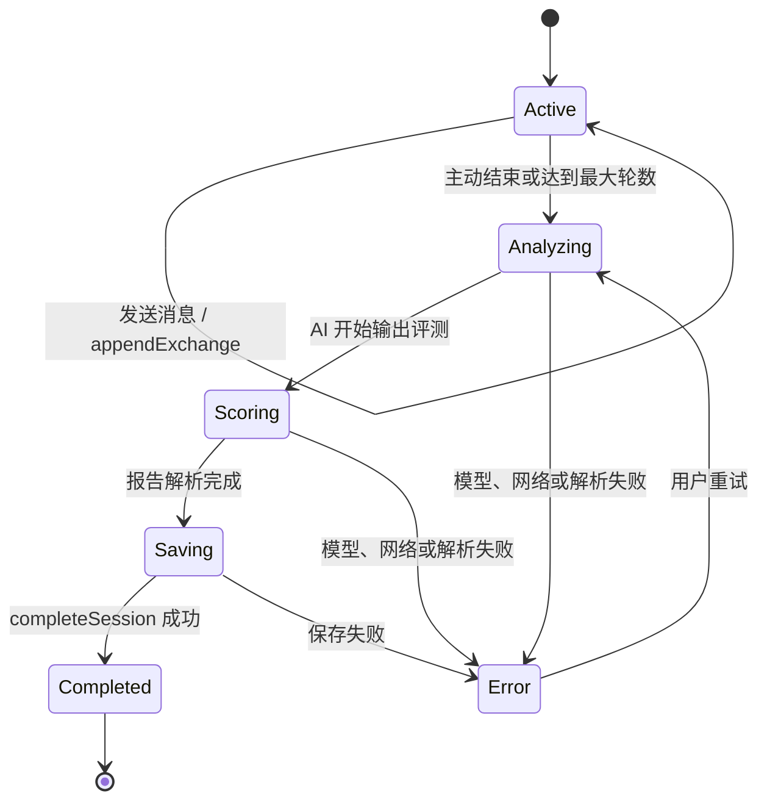
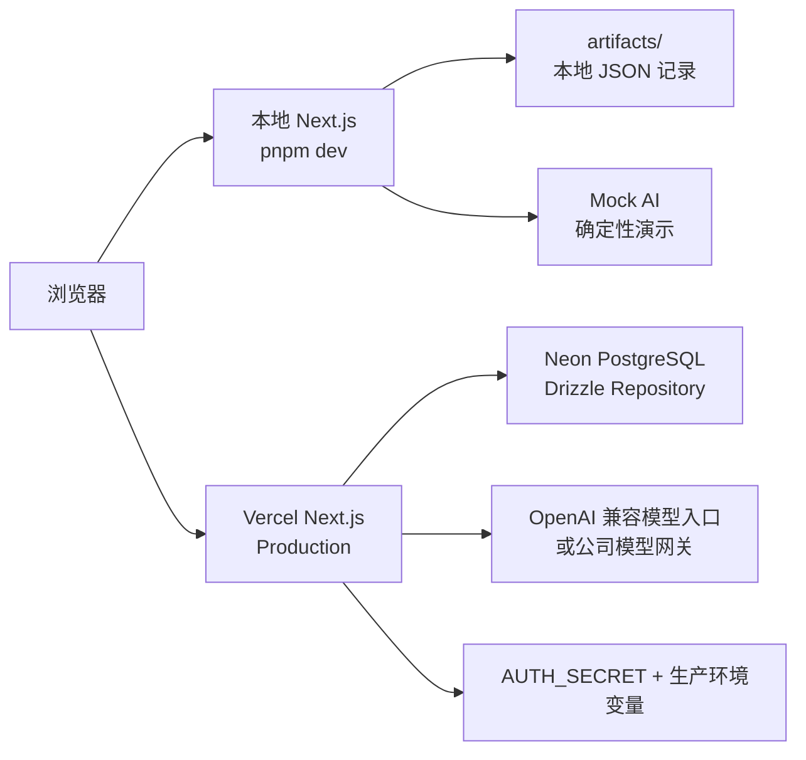

# AI 客服训练

> 面向宠物食品客服新人的 Web 培训应用：让新人先学习产品与服务知识，再通过 AI/演示情景练习接待，最后由系统生成反馈与复盘记录。

这是一个以知识库为基础、以题库和 AI 情景训练为核心的客服培训 MVP。项目同时提供学员端和管理端，覆盖内容发布、学习训练、过程记录、AI 评测与人工复核。

## 公司技术栈迁移入口

Phase 1–5 的新系统位于 `backend/`（FastAPI + SQLAlchemy + Alembic）和
`frontend/`（Vue 3 + Vite + Pinia）。管理员入口为 `/admin`，包含知识、题目、场景、
任务、报告复核和管理历史；Linux 生产配置位于 `deploy/`，迁移对账和维护窗口门禁位于
`backend/scripts/migrate_phase5.py`、`backend/scripts/rehearse_phase5.py` 和 `scripts/phase5_*.sh`。

迁移阶段、验收证据和真实生产窗口前置条件以 [Roadmap](docs/ROADMAP.md) 和
[Phase 5 验收报告](docs/superpowers/reports/2026-08-06-phase5-acceptance.md) 为准。

## 系统架构

下面这张图展示了项目从知识内容生产到学员训练、结果沉淀和管理员复核的完整闭环：



### 核心模块

| 模块 | 主要职责 | 代码位置 |
| --- | --- | --- |
| 知识库 | 解析 Markdown、Excel、思维导图；处理来源、版本、冲突和发布门禁 | `src/lib/knowledge/` |
| 题库训练 | 专题练习、正式小测、服务端判分、学习进度和历史 | `src/lib/quiz/` |
| AI 情景训练 | 多轮客服对话、实时风险识别、流式评测和复盘报告 | `src/lib/scenario/` |
| 培训管理 | 任务分配、训练目录、人工复核和管理端历史 | `src/lib/training/` |
| 数据与运行时 | Drizzle/Neon 持久化，以及本地 Demo 与生产实现的切换 | `src/db/`、`src/lib/runtime/` |

### 运行模式

| 模式 | 适用场景 | 主要实现 |
| --- | --- | --- |
| `local_demo` | 本地演示、开发和自动化测试 | 本地 JSON 存储、固定场景模板、Mock AI |
| `production` | 线上部署和真实业务数据 | Neon + Drizzle、数据库内容、OpenAI 兼容模型接口 |

当前项目的内容生产、学员训练和管理审核边界，详见 [工程交接说明](docs/AGENT-HANDOFF.md)。

## 用户与页面地图

登录后的页面按角色分成两条主线：学员负责训练和查看自己的结果，管理员负责内容、任务、审核和运营记录。



`/practice/assignments` 和 `/practice/history` 是兼容入口，会重定向到学员资料页对应的标签页；它们不是独立的业务模块。

## 业务调用与代码依赖方向

修改功能时，建议沿着“页面边界 → 业务服务 → 接口契约 → 具体适配器”的方向定位，不要让页面直接操作数据库或模型客户端。



当前的主要组合根是 `src/lib/runtime/services.ts`：它根据运行环境选择 Local、Database、Mock 或真实 AI 实现。后续拆分或接入公司服务时，应优先扩展接口和适配器，尽量保持页面和领域服务不变。

## 内容生产与发布流水线

正式题库和正式场景都应该能够追溯到知识版本；专题练习题目前仍有一条独立的代码内置路径，这是后续统一内容来源时需要重点处理的边界。



## 学员训练时序

### 题库训练



### AI 情景训练



## 场景训练状态机

数据库层面的会话状态主要是 `active` 和 `completed`；下面的 `analyzing`、`scoring`、`saving` 是报告生成期间通过 SSE 暴露给前端的阶段。



## 开发时的修改导航

| 需求 | 首先查看 | 通常还要同步检查 |
| --- | --- | --- |
| 修改登录、角色或路由权限 | `src/auth.ts`、`src/lib/auth/` | `src/proxy.ts`、页面入口、权限测试 |
| 修改专题练习、抽题或判分 | `src/lib/quiz/`、`src/app/practice/quiz/` | `src/lib/quiz/question-bank.ts`、答题存储和测试 |
| 修改正式题库审核与发布 | `src/lib/quiz/review.ts`、`src/db/quiz-draft-publication.ts` | `src/app/admin/questions/`、数据库迁移 |
| 修改 AI 对话或风险识别 | `src/lib/scenario/training-service.ts`、`src/lib/scenario/ai-providers.ts` | Prompt、Mock Provider、场景聊天组件 |
| 修改训练报告生成 | `src/lib/scenario/training-service.ts`、`src/app/api/scenario/complete/` | SSE 阶段、报告页、重试和持久化 |
| 修改知识库解析或来源追溯 | `src/lib/knowledge/` | `scripts/knowledge.ts`、发布脚本、知识库测试 |
| 修改场景模板或场景发布 | `src/lib/scenario/templates.ts`、`src/db/scenario-publication.ts` | 场景来源门禁、管理员场景页 |
| 修改任务、训练目录或人工复核 | `src/lib/training/` | `src/db/repositories/`、管理员页面和权限 |
| 修改数据库结构 | `src/db/schema.ts` | `drizzle/` 迁移、Repository、发布/验收脚本 |
| 修改本地 Demo 与生产切换 | `src/lib/runtime/mode.ts`、`env.ts`、`services.ts` | Local Store、Database Store、环境变量文档 |

建议的改动顺序是：先改领域 schema/接口和服务，再改适配器，最后接页面；如果只是文案或布局，才直接从 `src/app`、`src/components` 开始。

## 本地与生产依赖关系



线上真实 AI 目前的主要外部依赖是模型入口的网络可达性；如果 Vercel 无法通过公网 HTTPS 443 访问模型服务，Mock E2E 通过也不能代表真实 AI 生产链路可用。

## 当前结论

当前项目已经达到“内部演示 / 试用可用”的 Web MVP 阶段，核心训练闭环已经具备：

| 范围 | 当前状态 | 交接时需要知道的边界 |
| --- | --- | --- |
| 学员训练 | 已完成 | 专题练习、正式知识小测、情景对话、历史与报告 |
| 管理端 | 已完成 | 题目、场景、训练记录和复核入口 |
| 内容与数据 | 技术验收通过 | 5 个专题 350 道练习题；40 道可追溯正式题；8 个固定情景；Neon 持久化 |
| 登录 | MVP 实现 | 当前是 Auth.js Credentials 登录，不是企业 SSO |
| 线上部署 | 已部署 | Vercel + Neon 链路可用；生产初始化命令见 [部署与运维说明](docs/DEPLOYMENT.md) |
| 线上真实 AI | 尚未闭环验收 | Vercel 函数访问外部模型接口仍会超时；不能把 Mock E2E 结果当作真实 AI 生产验收 |
| 企业化接入 | 待沟通 | 飞书 SSO、企业用户映射、公司数据服务和模型网络由后续技术方案确定 |

因此，它适合现在拿给公司技术人员做代码、架构和交接评审；在接入真实公司流程前，还需要完成身份、数据、模型服务和运维边界的确认。

## 技术交接先读什么

| 文档 | 用途 |
| --- | --- |
| [工程交接说明](docs/AGENT-HANDOFF.md) | 如何启动、代码从哪里替换、需要向公司技术团队确认什么 |
| [MVP 验收矩阵](docs/MVP-ACCEPTANCE.md) | 哪些功能已通过自动化验证，哪些验收仍被外部条件阻塞 |
| [部署与运维说明](docs/DEPLOYMENT.md) | Vercel、Neon、环境变量、初始化、线上验收和故障处理 |
| [Roadmap](docs/ROADMAP.md) | 当前范围、下一步优先级和明确不纳入 MVP 的事项 |

## 当前能力

- 学员端：专题练习、正式小测、8 个情景实战、刷新恢复、训练历史和复盘报告。
- 管理端：角色保护、题目与场景管理、训练记录查看和可选人工复核。
- 知识与题库：Markdown、Excel、MM 知识适配器；版本、来源、冲突和跨版本引用校验；5 个专题共 350 道练习题；40 道正式题可通过技术门禁自动发布。
- 情景 AI：Mock 模式用于确定性演示和自动化测试；real 模式使用 OpenAI 兼容接口，支持连续上下文、风险识别和五维评分。
- 数据与部署：开发期可使用本地 Demo 回退；生产要求 Neon；当前部署目标为 Vercel。

## 本地启动

要求 Node.js 24 和 pnpm 10.33。

```bash
pnpm install
cp .env.example .env.local
pnpm dev
```

打开 <http://localhost:3000>。最快的本地演示方式是在 `.env.local` 中设置：

```text
LOCAL_TEST_AUTH_ENABLED=true
SEED_ADMIN_EMAIL=admin@example.test
SEED_ADMIN_PASSWORD=仅保存在本机的管理员密码
SEED_LEARNER_EMAIL=learner@example.test
SEED_LEARNER_PASSWORD=仅保存在本机的学员密码
```

该回退只在非生产环境且没有 `DATABASE_URL` 时生效。不要把真实密码、数据库连接串、API Key 或 `.env.local` 提交到 Git。

如果需要使用 Neon 数据库模式，先在 `.env.local` 填写 `DATABASE_URL`、长度至少 32 位的 `AUTH_SECRET` 和种子账号密码，然后按以下顺序初始化：

```bash
pnpm db:migrate
pnpm db:seed
pnpm knowledge:publish:db
pnpm quiz:publish:db
pnpm scenario:publish:db
pnpm production:verify:data
```

知识发布命令需要本地可访问原始知识源；原始客服知识库不进入 Git，交接时应通过公司批准的文件渠道提供。

## 质量检查

常规质量门禁：

```bash
pnpm check
```

它会依次执行 lint、类型检查、单元测试、Drizzle 检查和生产构建。需要单独运行 Mock E2E 时：

```bash
pnpm test:e2e
```

真实 AI 线上冒烟会产生模型调用并依赖 Vercel 到模型服务的网络可达性，不是普通 CI 门禁；只有在模型入口、额度和测试账号准备好后再运行：

```bash
pnpm test:e2e:live
```

## 企业化替换边界

当前实现保留了可替换的服务接口，接入公司流程时优先替换适配器和 Provider，不要从页面层重写训练流程：

| 当前实现 | 后续可能接入 | 主要位置 |
| --- | --- | --- |
| Auth.js Credentials + 角色会话 | 飞书 SSO、用户/部门映射、账号生命周期 | `src/auth.ts`、`src/lib/auth/` |
| 本地 Markdown / Excel / MM 适配器 | 企业知识服务或知识引擎 | `src/lib/knowledge/` |
| Neon + Drizzle Repository | 公司数据库或数据服务 | `src/db/`、`src/lib/runtime/services.ts` |
| Mock / OpenAI 兼容情景 Provider | 公司批准的模型网关、审计和额度管理 | `src/lib/scenario/` |
| Vercel Web 部署 | 公司域名、CI/CD、监控和密钥托管 | `vercel.json`、`docs/DEPLOYMENT.md` |

## AI 情景配置

默认 `SCENARIO_AI_MODE=mock`，适合本地演示和测试。启用真实 AI 时，在不提交的 `.env.local` 中配置：

```text
SCENARIO_AI_MODE=real
OPENAI_API_KEY=...
OPENAI_BASE_URL=https://your-approved-openai-compatible-endpoint.example/v1
OPENAI_MODEL=...
```

当前生产环境使用直连外部 OpenAI 兼容接口；本机请求曾成功，但 Vercel `hkg1` 到现有模型入口的请求超时。完成生产 AI 验收前，需要提供 Vercel 区域可达的公网 HTTPS 443 入口或公司批准的模型代理，并重新完成至少 3 轮对话、刷新恢复和报告生成验证。

## 项目结构

```text
src/app/                  Next.js 页面、路由和 Server Actions
src/components/           学员端、管理端和训练交互组件
src/lib/auth/             登录、角色和会话映射
src/lib/knowledge/        知识编译、来源、版本和发布
src/lib/quiz/             题库、抽题、判分和复核
src/lib/scenario/         情景模板、训练服务、Mock/real Provider
src/lib/training/         分配、目录和训练记录服务
src/db/                   Drizzle schema、迁移与 Neon Repository
scripts/                  数据初始化、知识/题库/场景发布和验收脚本
drizzle/                  数据库迁移文件
docs/                     验收、部署、Roadmap 和技术交接资料
```

## 公开仓库前的资料边界

当前仓库不包含原始知识库、环境文件、密码和生成产物，但代码中仍有公司专属产品名称、产品指标、客服话术和内部流程示例。将仓库设为 GitHub Public 前，必须由公司确认这些内容具备公开发布授权；否则应保持 Private，或先替换为公开安全的 Demo 内容后再建立 Public 镜像。

## 许可证

当前仓库尚未声明开源许可证。即使仓库设为 Public，也不等于自动授予第三方复制、修改或商用权利；公开前请由公司确认许可证和知识产权口径。
