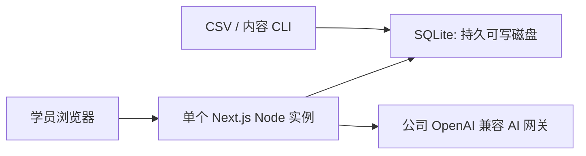

# AI 客服训练（学员轻量版）

本分支 `codex/learner-lite-sqlite` 将客服训练收敛为可在国内单机环境轻量运行的学员端：邮箱密码登录、专题/正式题、Mock 或公司 OpenAI 兼容网关的情景训练、报告和个人历史。

它尚未合并到 `main`。`main` 以及现有 Vercel + Neon 生产链路保持不变，服务器、域名、TLS、进程守护和定时备份方案批准前不得把本分支部署到 Vercel。

## 运行边界



- 仅有学员角色，无网页管理端、任务分配、审核或人工复核；旧完整应用由标签 `archive/full-app-before-learner-lite-20260810` 保留。
- 目标规模是约 100 个账号、30 人同时在线。SQLite 必须在**单一 Node.js 实例**和持久、可写的本地磁盘上运行。
- 运行时没有 Neon、PostgreSQL 或 JSON 回退。`SQLITE_PATH` 不可写、数据库损坏或 schema 版本不符时会直接失败。
- 公司 AI 网关继续走 OpenAI 兼容入口；真实 AI 三轮烟测需单独取得授权，日常验收使用确定性的 Mock AI。

## 本地启动

要求 Node.js 24.x、pnpm 10+。复制环境模板后，先创建 SQLite schema 和可用内容：

```bash
pnpm install
cp .env.example .env.local
pnpm db:migrate
pnpm learners:import -- --file learners.csv
pnpm knowledge:publish:db
pnpm quiz:publish:db
pnpm scenario:publish:db
pnpm db:verify
pnpm dev
```

`learners.csv` 表头固定为 `email,name,password,is_active`。密码只在导入时使用；已有账号留空密码即可保留原密码哈希。

## 运维命令

```bash
pnpm learners:import -- --file learners.csv
pnpm learners:disable -- --email learner@example.com
printf '%s\n' 'new-password' | pnpm learners:reset-password -- --email learner@example.com
pnpm db:verify
pnpm db:backup -- --output /safe/backup/training.sqlite
pnpm db:export:neon -- --output base-data.json
pnpm db:import:base -- --file base-data.json
```

Neon 导入/导出仅迁移有效学员、活动知识、正式题库和已发布场景；不会迁移历史答题、对话、报告或人工复核。真实 Neon 导出需要维护窗口提供只读凭据。

## 验证

```bash
pnpm check
pnpm test:e2e
pnpm test:sqlite:concurrency
```

Playwright 会准备独立临时 SQLite 数据库和 Mock AI 测试账号；不会使用个人 `.env.local` 的数据。真实公司网关验收另行运行 `pnpm test:e2e:live`，且只在获授权后进行。

并发命令默认运行约 3 秒的 30-worker 烟测；在已获资源窗口的服务器上可设 `SQLITE_LOAD_DURATION_MS=600000 pnpm test:sqlite:concurrency` 执行 10 分钟 soak。当前浏览器 E2E 验证专题历史的跨学员隔离；报告会话的越权读取由 Repository 权限契约测试覆盖。

详细部署边界见 [部署说明](docs/DEPLOYMENT.md)，接手代码时见 [工程交接](docs/AGENT-HANDOFF.md)。
