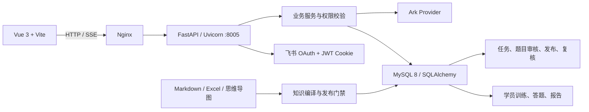

# AI 客服训练

面向客服新人的知识学习、题库训练和 AI 情景实战系统。当前 `main` 只保留公司标准栈：

- 后端：Python 3.12+、FastAPI、SQLAlchemy、Alembic、MySQL/PyMySQL。
- 前端：Vue 3、Vite、Vue Router、Pinia、Axios。
- 运行：Uvicorn、Nginx、systemd、Linux。
- 身份与模型：飞书 OAuth、Ark Provider（测试环境可显式使用确定性 Mock）。

阶段进度和未完成的外部切换事项以 [docs/ROADMAP.md](docs/ROADMAP.md) 为准；目标数据结构和迁移证据以 [docs/PHASE6-MIGRATION-MATRIX.md](docs/PHASE6-MIGRATION-MATRIX.md) 及 Phase 6 验收报告为准。

## 架构



所有写操作都经过 FastAPI 身份、角色、资源归属和状态校验；前端按钮隐藏不是安全边界。数据库迁移由 Alembic 管理，派生进度在事实数据导入后重新计算。

## 代码导航

| 需求 | 后端 | 前端 |
| --- | --- | --- |
| 登录、飞书身份、角色 | `backend/app/api/auth.py`、`backend/app/core/security.py` | `frontend/src/stores/auth.js`、`frontend/src/views/LoginView.vue` |
| 知识版本与题库 | `backend/app/services/knowledge/`、`backend/app/services/quiz/` | `frontend/src/stores/catalog.js`、`frontend/src/views/QuizTopicsView.vue` |
| 答题与进度 | `backend/app/api/quiz.py`、`backend/app/services/quiz/attempts.py` | `frontend/src/stores/quizAttempt.js`、`frontend/src/views/QuizAttemptView.vue` |
| 情景训练与报告 | `backend/app/api/scenario.py`、`backend/app/services/scenario/` | `frontend/src/views/Scenario*.vue`、`frontend/src/components/scenario/` |
| 管理端 | `backend/app/api/admin.py`、`backend/app/services/admin.py` | `frontend/src/views/Admin*.vue`、`frontend/src/views/ScenarioDraftGenerateView.vue` |
| PostgreSQL → MySQL | `backend/app/services/legacy_migration.py`、`backend/scripts/migrate_legacy.py` | — |
| 数据库结构 | `backend/app/models/`、`backend/alembic/versions/` | — |
| Linux 部署 | `deploy/nginx/`、`deploy/systemd/` | `install.sh`、`start.sh`、`build.sh`、`stop.sh`、`update.sh` |

旧书签 `/practice/profile`、`/practice/assignments`、`/practice/history` 和 `/practice/quiz` 由 Vue Router 显式跳转到等价页面。旧系统源码快照保留在双远程标签 `legacy-next-final-bb8d164`，不再回到 `main`。

## 本地开发

```bash
./install.sh
./start.sh
```

- Vue：<http://127.0.0.1:8006>
- FastAPI：<http://127.0.0.1:8005>
- API 文档：<http://127.0.0.1:8005/docs>

环境变量放在 `backend/.env`（不要提交），模板见 `backend/.env.example` 和 `deploy/env/backend.env.example`。本地可以使用 SQLite；生产必须使用包含 `charset=utf8mb4` 的 `mysql+pymysql://` 连接串。

## 检查与构建

```bash
./build.sh
bash scripts/test_phase6_scripts.sh
cd backend && .venv/bin/python -m pytest -q
npm --prefix frontend test -- --run
npm --prefix frontend run build
npm --prefix frontend run test:e2e:company-stack
```

Playwright 公司栈配置和测试位于 `frontend/playwright.company-stack.config.js` 与 `frontend/tests/e2e/`；浏览器测试会启动隔离 FastAPI/Vue 服务并使用确定性种子。

## 异构迁移

连接串只从环境变量读取，不放在命令行参数中：

```bash
LEGACY_DATABASE_URL='postgresql+psycopg://...' \
  backend/.venv/bin/python backend/scripts/migrate_legacy.py export \
  --output /secure/legacy-snapshot.jsonl \
  --manifest /secure/legacy-manifest.json

DATABASE_URL='mysql+pymysql://...?charset=utf8mb4' \
  backend/.venv/bin/python backend/scripts/migrate_legacy.py import \
  --input /secure/legacy-snapshot.jsonl \
  --report /secure/mysql-import-report.json \
  --topic-fixture backend/tests/fixtures/legacy-topic-question-bank.json

backend/.venv/bin/python backend/scripts/migrate_legacy.py reconcile \
  --manifest /secure/legacy-manifest.json \
  --report /secure/mysql-import-report.json
```

导出快照为版本化 JSONL，文件权限为 `0600`，不进入 Git；导入默认拒绝非空目标库，按表事务执行并支持幂等校验。`knowledge_progress` 和 `scenario_progress_summaries` 等聚合数据不作为事实源，导入后重算。

## 生产部署

生产配置样例和服务文件位于 `deploy/`：Nginx 反代前端静态文件与 8005 API，systemd 管理 Uvicorn。维护窗口预检和切换 dry-run：

```bash
APP_ENV=production ./scripts/phase6_preflight.sh --manifest /secure/mysql-import-report.json
./scripts/phase6_cutover.sh --dry-run --manifest /secure/mysql-import-report.json
```

真实数据库、飞书、Ark、域名、Nginx、systemd 和 DNS 切换需要公司开发、DBA、运维及飞书管理员共同执行；本地代码验收不等同于生产切换完成。

## 文档

- [项目技术栈模板](docs/PROJECT_TECH_STACK.md)
- [Roadmap](docs/ROADMAP.md)
- [旧功能/新 API/目标表对应矩阵](docs/PHASE6-MIGRATION-MATRIX.md)
- [部署与切换说明](docs/DEPLOYMENT.md)
- [开发交接说明](docs/AGENT-HANDOFF.md)
- [Phase 6 验收报告](docs/superpowers/reports/2026-08-06-phase6-acceptance.md)

历史 Phase 1–5 计划保留在 `docs/superpowers/`，仅作为迁移记录，不是当前运行说明。
