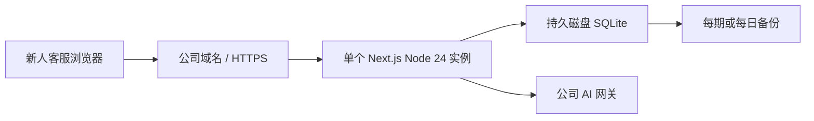

# AI 客服训练 MVP

这是一个给新人客服做短期培训的轻量工具。学员可以登录后刷题、进行 AI 模拟接待、查看评分报告和自己的训练记录。

产品按一批新人使用一周到一个月设计，不追求复杂的企业平台能力。当前版本已经可以演示，也接近可供小范围真实培训使用；正式试用前主要需要把它部署到能保存数据、能访问公司 AI 网关的环境。

## 现在做到什么程度

| 能力 | 当前状态 | 说明 |
|---|---|---|
| 学员登录 | 可用 | 当前使用邮箱和密码，账号通过命令批量导入、停用或重置密码 |
| 题库训练 | 可用 | 支持专题练习、正式题、服务端判分和个人历史 |
| AI 模拟接待 | 本地真实 AI 可用 | 支持连续对话、刷新恢复、风险提示和评分报告 |
| Mock 演示 | 可用 | 不调用真实模型，适合演示页面和完整操作流程 |
| 数据隔离 | 已验证 | 不同学员只能看到自己的答题和情景训练记录 |
| 网页管理后台 | 暂无 | 当前由技术人员通过命令维护账号和培训内容 |
| 飞书 OAuth | 尚未接入 | 不影响当前 MVP 试用，可在部署稳定后增量接入 |

一句话判断：**现在不是长期运营的大型培训平台，但已经是一个可以继续部署验证的新人培训 MVP。**

## 当前线上演示

演示地址：<https://ai-customer-service-training.vercel.app/login>

当前 Vercel 环境开启了：

```text
DEMO_MODE=true
SCENARIO_AI_MODE=mock
```

因此这个地址只用于看产品和走流程：

- 可以直接进入“演示学员”；
- 使用 Mock AI，不调用公司真实模型；
- 数据保存在当前运行实例的内存 SQLite 中；
- Vercel 冷启动、实例切换或重新部署后，演示数据会重置。

不要把这个演示地址当作正式培训环境，也不要把 Mock 报告当作真实 AI 的评分结果。

## 为什么本地 AI 可用，Vercel 不可用

公司 AI 接口当前只能通过公司网络或 VPN 路径访问。本地 `localhost` 可以连接该网关，但 Vercel 函数不在公司网络内，请求会超时。

这不是代码不会调用 AI，也不是 Vercel 完全不能调用外部 AI，而是部署环境到公司 AI 网关的网络没有打通。当前代码已保留两种模式：

- `SCENARIO_AI_MODE=mock`：确定性演示，不访问真实模型；
- `SCENARIO_AI_MODE=real`：访问公司批准的 OpenAI 兼容网关。

正式部署后，需要在目标环境完成至少三轮真实对话、刷新恢复和报告生成，才算 AI 功能真正验收通过。

## 推荐的最简部署方式

第一批新人培训建议直接部署在公司网络中的一台 Linux 服务器或固定主机上：



这条路线与现有代码最匹配，也最省改造成本：

- 保留 SQLite，不需要现在迁移 PostgreSQL；
- 单实例运行，不做复杂的横向扩容；
- 部署在公司网络内，更容易访问 AI 网关；
- 每批培训开始前准备账号和内容，结束后备份或导出结果。

如果以后要长期运营、多实例、高可用或支持更大规模，再考虑托管 PostgreSQL、完整监控和管理后台。

## MVP 使用边界

当前适合：

- 一批新人使用一周到一个月；
- 有限账号、小范围受控培训；
- 学员自己刷题、模拟接待并查看个人结果；
- 技术人员通过 CLI 维护账号和培训内容；
- 出现问题时有人可以人工处理或重开本期数据。

当前暂不解决：

- 主管在网页上布置任务、查看团队排名或人工复核评分；
- 多部门复杂权限和组织同步；
- 多实例、高可用、无停机扩容；
- 用 AI 分数直接做员工绩效或正式认证；
- 长期保存大量历史培训数据。

这些都可以后续增加，但不是当前短周期培训 MVP 的前置条件。

## 本地运行

要求 Node.js 24.x、pnpm 10+。

```bash
pnpm install
cp .env.example .env.local
pnpm db:migrate
pnpm learners:import -- --file learners.csv
pnpm knowledge:publish:db
pnpm quiz:publish:db
pnpm scenario:publish:db
pnpm db:verify
pnpm dev
```

正式运行至少需要：

```text
SQLITE_PATH=/path/to/persistent/training.sqlite
AUTH_SECRET=<至少32位随机值>
SCENARIO_AI_MODE=mock|real
```

真实 AI 模式还要配置公司批准的 `OPENAI_API_KEY`、`OPENAI_BASE_URL` 和 `OPENAI_MODEL`。密钥只能放在部署环境中，不能提交到 Git。

临时本地演示可以使用：

```bash
DEMO_MODE=true AUTH_SECRET='<至少32位随机值>' SCENARIO_AI_MODE=mock pnpm dev
```

## 常用维护命令

```bash
pnpm learners:import -- --file learners.csv
pnpm learners:disable -- --email learner@example.com
printf '%s\n' 'new-password' | pnpm learners:reset-password -- --email learner@example.com
pnpm db:verify
pnpm db:backup -- --output /safe/backup/training.sqlite
```

`learners.csv` 表头固定为 `email,name,password,is_active`。新账号需要至少 8 位密码；已有账号留空密码可以保留原密码哈希。

## 当前验证结果

- `pnpm check`：ESLint、TypeScript、191 个测试、Drizzle 检查和 Next.js production build 通过；
- `pnpm test:e2e`：3 个 Mock 浏览器测试通过；
- `pnpm e2e:prepare && pnpm test:sqlite:concurrency`：30 workers、1500 条并发写入通过；
- 真实 AI 本地可用，但本轮没有重新调用公司模型复测；
- Vercel 真实 AI 仍受公司网关网络可达性阻塞。

项目声明 Node.js 24.x。本轮本机验证运行在 Node.js 26.6.0，技术人员在正式服务器上仍应使用 Node.js 24 再执行一次完整验证。

## 技术人员接手时优先确认

1. 目标服务器是否有持久可写磁盘；
2. 目标服务器是否能访问公司 AI 网关；
3. 正式域名、HTTPS 和进程守护由谁负责；
4. 每期培训数据保留多久、由谁备份；
5. 飞书 OAuth 使用什么用户标识绑定内部账号。

更详细的现状、问题和接手清单见 [handoff.md](handoff.md)，部署细节见 [docs/DEPLOYMENT.md](docs/DEPLOYMENT.md)。
