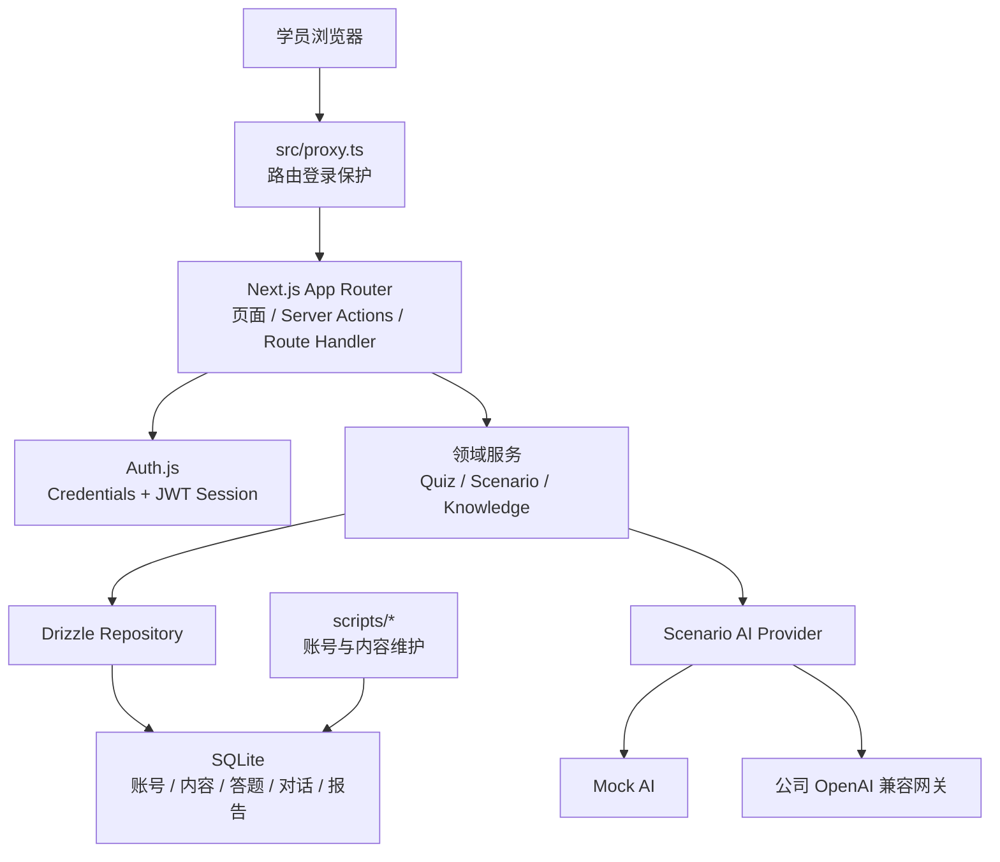
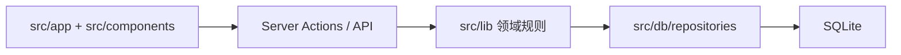
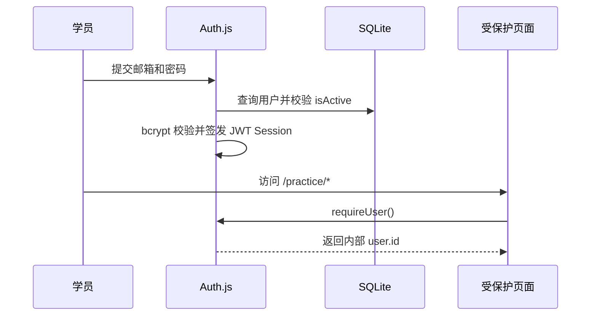
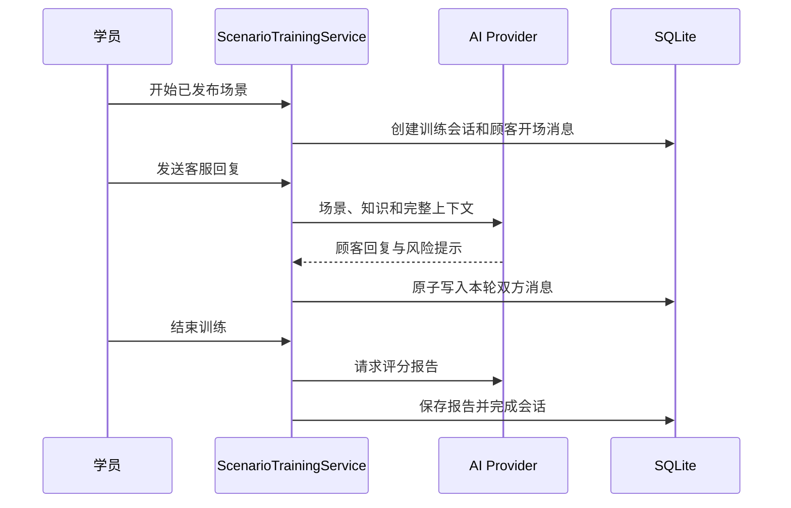

# AI 客服训练 MVP

这是一个面向新人客服的短期培训工具。学员登录后可以完成专题练习、正式题和 AI 模拟接待，并在个人中心查看答题结果、对话报告和历史记录。

项目当前定位为一周到一个月的轻量培训 MVP：功能闭环已经形成，账号和内容由技术人员通过命令维护，暂不建设复杂的主管后台、组织权限和长期数据平台。

## 当前状态

| 能力 | 状态 | 说明 |
|---|---|---|
| 邮箱密码登录 | 可用 | 支持批量导入、停用账号和重置密码 |
| 专题与正式题 | 可用 | 服务端判分，结果按学员保存 |
| AI 模拟接待 | 本地真实 AI 可用 | 支持多轮对话、刷新恢复、风险提示和评分报告 |
| Mock 情景 | 可用 | 不访问真实模型，用于开发、测试和线上演示 |
| 个人历史 | 可用 | 学员只能查看自己的答题和情景记录 |
| 网页管理后台 | 未提供 | 账号、知识、题库和场景当前通过 CLI 维护 |
| 飞书 OAuth | 未接入 | 现有 Auth.js 只有 Credentials 登录，可后续增量接入 |

当前 Vercel 地址 <https://ai-customer-service-training.vercel.app/login> 使用内存 SQLite 和 Mock AI，只用于产品演示。真实 AI 在本地可以连接公司 OpenAI 兼容网关；Vercel 因无法进入公司网络路径而超时。

## 当前运行架构

当前生产代码是仓库根目录的 Next.js 应用，不是 `backend/` 和 `frontend/` 中的历史 Vue/FastAPI 迁移代码。



### 请求与数据分层



- 页面层负责路由、展示和提交用户操作；
- Server Actions 和 Route Handler 从 Auth.js Session 取得当前学员身份；
- `src/lib/` 保存登录、判分、情景训练、提示词和运行模式等业务规则；
- Repository 负责数据库读写，并用 `learnerId` 约束学员数据范围；
- Drizzle Schema 和 SQLite 约束负责外键、唯一性、状态值和版本引用；
- AI Provider 在 Mock 和真实 OpenAI 兼容接口之间切换。

## 技术栈

| 层次 | 技术 | 当前用途 |
|---|---|---|
| 应用框架 | Next.js 16 App Router | 页面、Server Actions、Route Handler、服务端渲染 |
| UI | React 19、Tailwind CSS 4 | 学员端页面和响应式组件 |
| 语言 | TypeScript 5.9 | 前后端共享类型和业务逻辑 |
| 身份认证 | Auth.js 5 beta、bcryptjs | Credentials 登录、JWT Session、密码哈希 |
| 数据库 | SQLite、better-sqlite3 | 单实例持久数据或内存演示数据 |
| ORM 与迁移 | Drizzle ORM、Drizzle Kit | Schema、查询、事务和 SQL migration |
| AI | OpenAI Node SDK | Mock Provider 或公司 OpenAI 兼容网关 |
| 校验 | Zod | 表单、服务输入、环境变量和持久化对象校验 |
| 内容处理 | ExcelJS、Markdown/AST 工具 | 解析和发布知识、题库、场景内容 |
| 测试 | Vitest、Testing Library、Playwright | 单元、组件、Repository 和浏览器 E2E |
| 工程工具 | pnpm、ESLint | 依赖、代码检查和统一验证 |

运行版本以 [`package.json`](package.json) 为准。当前要求 Node.js 24.x、pnpm 10+。

## 项目结构

```text
.
├── src/
│   ├── app/                 # Next.js 路由、页面、Server Actions、API
│   ├── components/          # 通用 UI、题库和情景交互组件
│   ├── db/                  # SQLite Client、Drizzle Schema、Repository、迁移辅助
│   ├── lib/                 # auth / knowledge / quiz / scenario / runtime 领域逻辑
│   ├── auth.ts              # Auth.js 配置、Provider、Session 回调和路由授权
│   └── proxy.ts             # Next.js 请求入口和登录保护
├── drizzle/                 # 当前 SQLite SQL migration 与元数据
├── scripts/                 # 账号、内容、迁移、校验和备份 CLI
├── tests/
│   ├── e2e/                 # Playwright 浏览器流程
│   ├── load/                # SQLite 并发烟测
│   └── scripts/             # 历史公司技术栈脚本测试
├── docs/                    # 当前 SQLite 部署与运维文档
├── backend/                 # 历史 FastAPI 迁移代码，当前不运行
├── frontend/                # 历史 Vue/Vite 迁移代码，当前不运行
├── deploy/                  # 历史迁移部署样例，不能代表当前入口
├── package.json             # 当前应用依赖和统一命令
└── vercel.json              # 当前 Vercel 演示区域配置
```

`backend/`、`frontend/`、`deploy/` 仅用于保留此前迁移工作的历史证据。开发当前产品时，先从根目录 `package.json`、`src/`、`drizzle/` 和 `scripts/` 开始，不要运行历史目录中的启动或部署命令。

## 核心业务流程

### 1. 登录与访问控制



- 正式账号来自 `users` 表；
- 演示登录只有 `DEMO_MODE=true` 时才会启用；
- 学员停用后不能再次登录；
- 当前 Session 使用 JWT，账号停用或改密不会立即撤销已经签发的 Session，这是后续认证加固点。

### 2. 题库训练


正确答案不会依赖浏览器传回的判分结果。提交时，服务端从当前已发布题组读取正式答案，重新计算分数，并把记录写到当前 Session 对应的 `learnerId` 下。

### 3. AI 情景训练



- `SCENARIO_AI_MODE=mock` 使用确定性 Provider，不产生真实模型调用；
- `SCENARIO_AI_MODE=real` 使用公司批准的 OpenAI 兼容接口；
- 会话绑定启动时的知识版本和场景版本，内容重新发布不会改写历史训练；
- 报告、消息和会话查询都带学员身份约束。

### 4. 内容发布

知识、正式题组和场景不是运行时临时拼出的 JSON，而是通过 CLI 编译、校验、版本化后发布到 SQLite：

```text
源文件
  → 内容适配与结构校验
  → 知识版本
  → 正式题组 / 场景版本
  → 发布状态
  → 学员运行时只读取已发布版本
```

内容相关入口主要位于 `src/lib/knowledge/`、`src/lib/quiz/`、`src/lib/scenario/` 和 `scripts/publish-*-to-db.ts`。

## 主要数据表

| 数据组 | 主要表 | 作用 |
|---|---|---|
| 账号 | `users` | 学员身份、密码哈希、启停状态和登录时间 |
| 知识 | `knowledge_versions`、`knowledge_sources`、`knowledge_units` | 版本化知识和来源追踪 |
| 正式题库 | `questions`、`quiz_sets`、`quiz_set_questions` | 已发布题目与题组 |
| 答题历史 | `quiz_attempts`、`quiz_answers`、`topic_quiz_attempts` | 学员成绩和答案 |
| 情景模板 | `scenarios`、`scenario_versions` | 已发布场景和版本内容 |
| 情景训练 | `training_sessions`、`training_messages`、`evaluation_reports` | 对话、轮次状态和评分报告 |

完整字段和约束见 [`src/db/schema.ts`](src/db/schema.ts)，迁移记录见 [`drizzle/`](drizzle/)。

## 修改什么，先看哪里

| 需求 | 代码入口 |
|---|---|
| 修改登录、Session 或演示身份 | `src/auth.ts`、`src/lib/auth/`、`src/app/login/` |
| 增加飞书 OAuth | `src/auth.ts`、`src/db/schema.ts`、`src/lib/auth/` |
| 修改页面布局与样式 | `src/app/`、`src/components/ui/`、`src/app/globals.css` |
| 修改题库页面和答题流程 | `src/app/practice/quiz/`、`src/components/quiz/` |
| 修改题目抽取或判分规则 | `src/lib/quiz/`、`src/db/repositories/db-quiz-attempt-store.ts` |
| 修改 AI 对话流程 | `src/lib/scenario/training-service.ts`、`src/lib/scenario/ai-providers.ts` |
| 修改提示词与风险规则 | `src/lib/scenario/prompt-templates.ts`、`src/lib/scenario/knowledge-matching.ts` |
| 修改情景页面和报告 | `src/app/practice/scenario/`、`src/components/scenario/` |
| 修改数据库或约束 | `src/db/schema.ts`、`drizzle/`、`src/db/repositories/` |
| 修改运行模式和环境校验 | `src/lib/runtime/`、`.env.example` |
| 导入账号、发布内容或备份 | `scripts/`、`package.json` |
| 增加自动化测试 | 对应模块的 `*.test.*`、`tests/e2e/`、`tests/load/` |

## 本地开发

### 1. 安装和配置

```bash
pnpm install
cp .env.example .env.local
```

最小持久模式配置：

```text
SQLITE_PATH=./data/training.sqlite
DEMO_MODE=false
AUTH_SECRET=<至少32位随机值>
SCENARIO_AI_MODE=mock
```

### 2. 初始化数据

```bash
pnpm db:migrate
pnpm learners:import -- --file learners.csv
pnpm knowledge:publish:db
pnpm quiz:publish:db
pnpm scenario:publish:db
pnpm db:verify
```

`learners.csv` 表头固定为 `email,name,password,is_active`。新账号密码至少 8 位；更新已有账号时可以留空密码，保留原密码哈希。

### 3. 启动

```bash
pnpm dev
```

如只想查看演示数据和 Mock 情景，可以使用内存演示模式：

```bash
DEMO_MODE=true AUTH_SECRET='<至少32位随机值>' SCENARIO_AI_MODE=mock pnpm dev
```

### 4. 真实 AI 配置

```text
SCENARIO_AI_MODE=real
OPENAI_API_KEY=<公司网关凭据>
OPENAI_BASE_URL=<公司 OpenAI 兼容入口>
OPENAI_MODEL=<批准使用的模型>
```

也可以使用代码已支持的 AI Gateway 变量，完整字段见 [`.env.example`](.env.example) 和 [`src/lib/scenario/ai-client.ts`](src/lib/scenario/ai-client.ts)。所有密钥只能保存在部署环境中，不能提交到 Git。

## 测试与质量门禁

```bash
pnpm check
pnpm test:e2e
DEMO_MODE=true pnpm test:e2e:demo
pnpm e2e:prepare
pnpm test:sqlite:concurrency
```

| 命令 | 覆盖范围 |
|---|---|
| `pnpm check` | ESLint、TypeScript、Vitest、Drizzle check、production build |
| `pnpm test:e2e` | 登录、停用账号、跨学员隔离、Mock 对话和报告 |
| `pnpm test:e2e:demo` | 内存演示入口和演示数据 |
| `pnpm test:sqlite:concurrency` | 30-worker SQLite 短时并发写入烟测 |
| `pnpm test:e2e:live` | 真实 AI 冒烟，会产生模型调用，只能在获授权后运行 |

并发测试依赖已完成 migration 的临时数据库，因此要先执行 `pnpm e2e:prepare`。Playwright 默认使用隔离的 `.tmp/learner-lite-e2e.sqlite`，不会读取本地业务数据库。

最近一次验证结果：64 个 Vitest 文件、191 个测试通过，Mock E2E 3 个场景通过；SQLite 烟测完成 30 workers、1500 条写入。本机验证使用 Node.js 26.6.0，正式运行仍应按 `package.json` 使用 Node.js 24.x 复验。

## 运行模式与部署边界

| 场景 | 数据库 | AI | 用途 |
|---|---|---|---|
| 本地开发 | 文件 SQLite | Mock 或真实网关 | 开发和联调 |
| Vercel 当前演示 | 内存 SQLite | Mock | 看页面和流程，数据会重置 |
| 正式学员环境 | 持久文件 SQLite | Mock 或真实网关 | 当前架构要求单个 Node.js 实例和可写磁盘 |

当前 SQLite Client 使用 WAL、5 秒 `busy_timeout`、外键和启动完整性检查。它适合当前轻量单实例架构，但不能把同一个 SQLite 文件交给多个应用实例并行使用。

具体选择部署在哪里、如何配置 HTTPS、进程守护、备份和公司网络，由接手技术人员根据现有基础设施决定。项目只明确以下技术约束：

- 正式数据不能使用 `DEMO_MODE=true`；
- `SQLITE_PATH` 必须指向持久、可写磁盘；
- 当前数据库方案只支持单应用实例；
- 真实 AI 必须从目标运行环境访问公司网关并重新验收；
- `AUTH_SECRET`、AI 密钥和备份文件不得进入 Git。

详细交接判断见 [`handoff.md`](handoff.md)，部署操作边界见 [`docs/DEPLOYMENT.md`](docs/DEPLOYMENT.md)。

## 当前已知问题

- Vercel 只能运行内存 SQLite 演示，不能保存正式培训数据；
- Vercel 当前无法访问依赖公司网络或 VPN 的 AI 网关，本地真实 AI 正常；
- 当前只有学员角色，没有网页管理后台；
- 账号停用或改密不会立即撤销已经签发的 JWT Session；
- 登录尚未增加专门的频率限制或失败锁定；
- 生产依赖审计仍有来自 Next 和 Excel 处理链的安全告警，需要部署人员评估升级；
- `backend/`、`frontend/`、`deploy/` 是历史代码，容易误导接手者。

这些问题不影响 Mock 演示和受控开发验证；是否阻断正式试用，要结合部署网络、使用范围和数据要求判断。

## 文档索引

| 文档 | 用途 |
|---|---|
| [`handoff.md`](handoff.md) | 当前适用性、AI 网关、部署和飞书 OAuth 技术交接 |
| [`docs/DEPLOYMENT.md`](docs/DEPLOYMENT.md) | SQLite 部署、环境变量、初始化、备份和切换边界 |
| [`AGENTS.md`](AGENTS.md) | 仓库协作、提交和双远程交付规范 |

过期的 Neon、Vue/FastAPI 迁移、旧验收和过程设计文档已从当前工作树移除。如需追溯，可通过 Git 历史查看。
