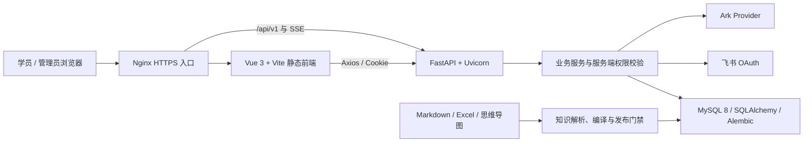
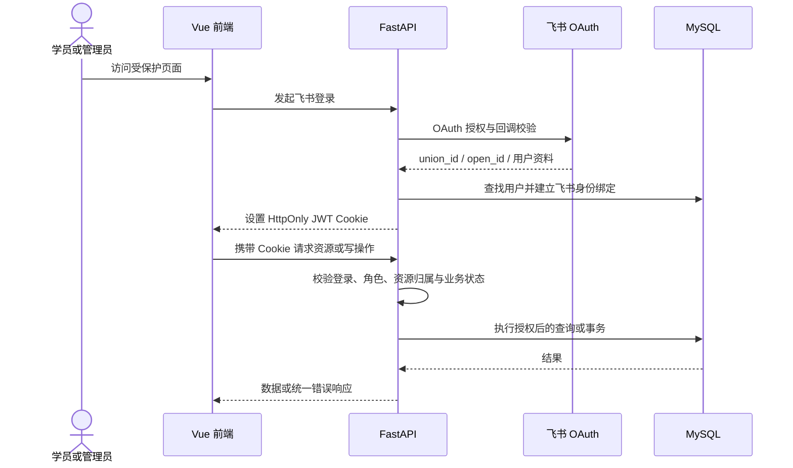
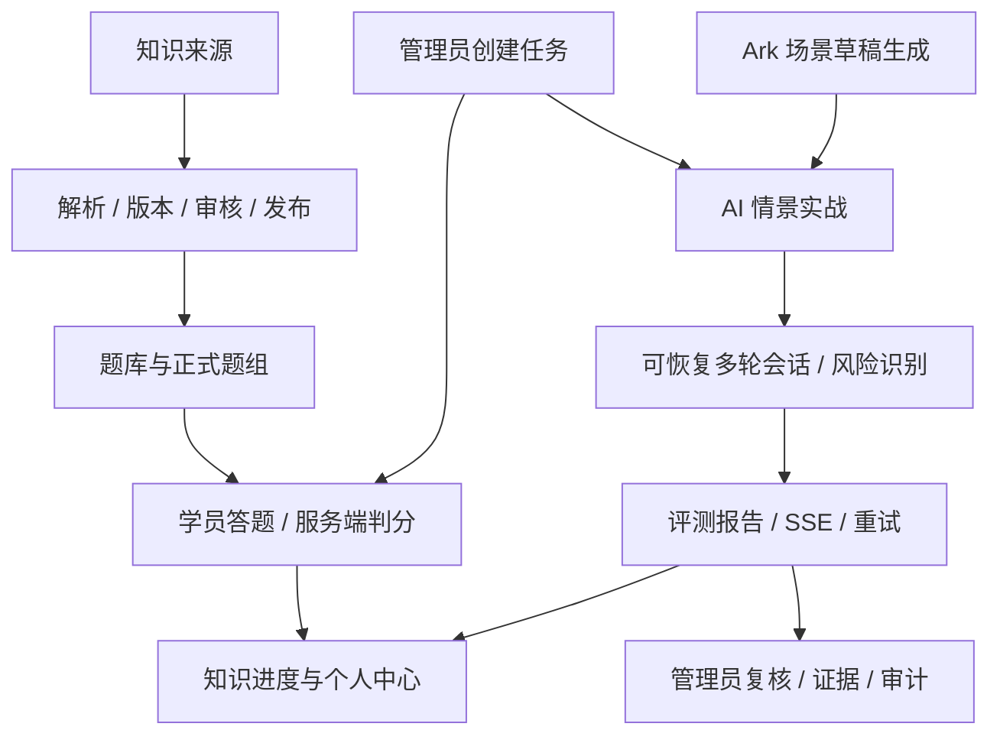
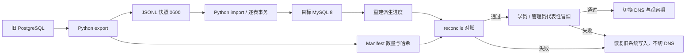
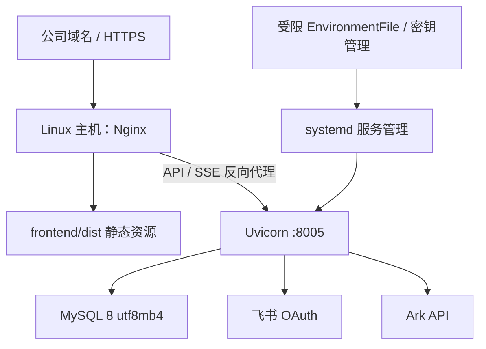

# AI 客服训练

面向客服新人的知识学习、题库训练与 AI 情景实战系统。本文是技术负责人、开发和运维人员接手当前 `main` 的总入口。

## 当前交付状态

| 轨道 | 状态 | 说明 |
| --- | --- | --- |
| 代码级重构 | **已完成** | `main` 仅保留 Vue/FastAPI/MySQL 目标栈，旧 Next.js/React/Auth.js/Drizzle/Neon 运行代码已退役 |
| PostgreSQL → MySQL 数据迁移 | **待公司执行** | 迁移工具和自动化测试已完成，尚需两次真实隔离数据库演练 |
| 公司生产切换 | **待公司执行** | 尚需飞书、Ark、MySQL、域名、Nginx、systemd、密钥和维护窗口权限 |

代码级重构已经符合 [公司项目技术模板](docs/PROJECT_TECH_STACK.md)，但整体迁移不能标记为 100%；只有 [验收标准](docs/ACCEPTANCE.md) 的三条轨道全部通过，才算完成真实生产迁移。

> **Vercel 已退役。** GitHub 上残留的 Vercel Production 自动部署失败，是旧集成仍在尝试部署已不含 Next/Vercel 配置的新仓库，不代表 pytest、Vitest、Vite build 或 Playwright 失败。仓库管理员应在 Vercel/GitHub 中断开旧项目集成，不要为消除红色状态恢复旧技术栈。

旧系统源码只通过双远程标签 `legacy-next-final-bb8d164` 恢复到隔离目录，不重新合并回 `main`。

## 公司技术模板对应

版本以 [`backend/requirements.txt`](backend/requirements.txt) 和 [`frontend/package.json`](frontend/package.json) 为准。

| 层级 | 公司标准 | 当前实现 |
| --- | --- | --- |
| 后端语言与框架 | Python 3.12+、FastAPI | Python 3.12+、FastAPI 0.115.12、Uvicorn 0.34.2 |
| 数据访问与迁移 | SQLAlchemy、Alembic、MySQL/PyMySQL | SQLAlchemy 2.0.27、Alembic 1.13.3、PyMySQL 1.1.0、MySQL 8 `utf8mb4` |
| 前端 | Vue 3、Vite、Vue Router、Pinia、Axios | Vue `^3.4.0`、Vite `^5.4.0`、Vue Router `^4.3.0`、Pinia `^3.0.4`、Axios `^1.7.0` |
| 测试 | 后端、组件、浏览器闭环 | pytest、Vitest/Vue Test Utils、Playwright |
| 生产运行 | Linux、Nginx、systemd、Uvicorn | `deploy/` 模板、Nginx 静态资源与 API/SSE 反代、systemd 托管 Uvicorn |
| 企业服务 | 飞书身份、Ark 模型 | 飞书 OAuth + JWT Cookie；Ark Provider，测试环境才允许显式 Mock |

## 1. 总体系统架构



## 2. 鉴权与权限链路



前端路由守卫和按钮隐藏只改善体验，不是安全边界；所有写操作都由 FastAPI 服务端校验。

## 3. 核心业务模块



## 4. 数据迁移与生产切换



迁移只通过 `LEGACY_DATABASE_URL` 和 `DATABASE_URL` 读取连接串。快照、Manifest 和导入报告必须保存在受限目录，禁止提交 Git。

## 5. 生产部署拓扑



## 修改什么看哪里

| 修改目标 | 主要入口 |
| --- | --- |
| 登录、飞书身份、Cookie 与权限 | `backend/app/api/auth.py`、`backend/app/core/dependencies.py`、`backend/app/core/security.py`、`backend/app/utils/feishu_oauth.py`、`frontend/src/stores/auth.js` |
| 知识解析、版本与题库发布 | `backend/app/services/knowledge/`、`backend/app/services/quiz/publication.py`、`backend/app/api/catalog.py`、`frontend/src/stores/catalog.js` |
| 答题、判分与进度 | `backend/app/api/quiz.py`、`backend/app/services/quiz/attempts.py`、`backend/app/api/overview.py`、`frontend/src/stores/quizAttempt.js` |
| AI 实战、风险与报告 | `backend/app/api/scenario.py`、`backend/app/services/scenario/`、`frontend/src/stores/scenarioTraining.js`、`frontend/src/views/Scenario*.vue` |
| 管理端任务、审核、发布与复核 | `backend/app/api/admin.py`、`backend/app/services/admin.py`、`frontend/src/stores/admin.js`、`frontend/src/views/Admin*.vue` |
| PostgreSQL → MySQL 迁移 | `backend/scripts/migrate_legacy.py`、`backend/app/services/legacy_migration.py`、`docs/PHASE6-MIGRATION-MATRIX.md` |
| 数据库模型与版本 | `backend/app/models/`、`backend/alembic/versions/` |
| Linux 部署与切换 | `deploy/nginx/`、`deploy/systemd/`、`scripts/phase6_preflight.sh`、`scripts/phase6_cutover.sh`、`docs/DEPLOYMENT.md` |

## 开发、测试与构建

```bash
./install.sh
./start.sh
```

- Vue：<http://127.0.0.1:8006>
- FastAPI：<http://127.0.0.1:8005>
- API 文档：<http://127.0.0.1:8005/docs>

环境变量写入不提交的 `backend/.env`，模板见 `backend/.env.example` 和 `deploy/env/backend.env.example`。本地测试可使用 SQLite；生产必须使用带 `charset=utf8mb4` 的 `mysql+pymysql://` 连接串。

```bash
./build.sh
bash scripts/test_phase6_scripts.sh
cd backend && .venv/bin/python -m pytest -q
npm --prefix frontend test -- --run
npm --prefix frontend run build
npm --prefix frontend run test:e2e:company-stack
```

## PostgreSQL → MySQL 迁移命令

```bash
LEGACY_DATABASE_URL='postgresql+psycopg://...' \
  backend/.venv/bin/python backend/scripts/migrate_legacy.py export \
  --output /secure/legacy-snapshot.jsonl \
  --manifest /secure/legacy-manifest.json

DATABASE_URL='mysql+pymysql://...?charset=utf8mb4' \
  backend/.venv/bin/python backend/scripts/migrate_legacy.py import \
  --input /secure/legacy-snapshot.jsonl \
  --report /secure/mysql-import-report.json \
  --topic-fixture backend/tests/fixtures/legacy-topic-question-bank.json

backend/.venv/bin/python backend/scripts/migrate_legacy.py reconcile \
  --manifest /secure/legacy-manifest.json \
  --report /secure/mysql-import-report.json
```

导入默认拒绝非空目标库，按表事务执行并保护重复导入；`knowledge_progress`、`scenario_progress_summaries` 等派生数据从事实表重建。完整操作和回滚顺序见 [部署与切换说明](docs/DEPLOYMENT.md)。

## 移交状态

| 已完成并可移交 | 待公司开发、DBA、运维和飞书管理员执行 |
| --- | --- |
| Vue/FastAPI/MySQL 代码重构与旧运行栈退役 | 提供两套隔离 PostgreSQL/MySQL 环境并完成两次全量演练 |
| 后端、前端、构建、浏览器和迁移脚本自动化验证 | 配置正式 MySQL、飞书 OAuth、Ark、域名、Nginx、systemd 与密钥 |
| Python 异构迁移、幂等门禁、派生数据重建与对账工具 | 确认维护窗口，冻结旧写入并执行最终快照、导入和对账 |
| 旧系统双远程恢复标签 `legacy-next-final-bb8d164` | 完成代表性冒烟、DNS 切换、观察期和旧系统下线签字 |

## 当前文档入口

| 文档 | 回答的问题 |
| --- | --- |
| [项目技术栈模板](docs/PROJECT_TECH_STACK.md) | 公司要求的基础技术标准是什么 |
| [Roadmap](docs/ROADMAP.md) | 三条轨道当前到哪里、还有什么未完成 |
| [统一验收标准](docs/ACCEPTANCE.md) | 哪些已经通过、哪些必须由公司环境验证 |
| [迁移对应矩阵](docs/PHASE6-MIGRATION-MATRIX.md) | 旧功能、旧表、新 API/页面和目标表如何对应 |
| [部署与切换说明](docs/DEPLOYMENT.md) | Linux 部署、演练、切换和回滚怎么执行 |
| [开发交接说明](docs/AGENT-HANDOFF.md) | 接手人员从哪些目录和命令开始 |
| [历史迁移归档](docs/archive/README.md) | 如何审计 Phase 1–6 的旧计划、规格和原始报告 |

归档内容只用于审计与历史追溯，不是当前运行说明。
