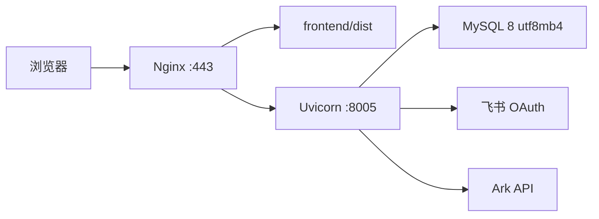

# 部署与切换说明

本文只描述当前 Vue/FastAPI/MySQL 系统。旧系统仅作为标签快照保留，回滚源码标签为 `legacy-next-final-bb8d164`，不作为当前部署方案。

## 运行拓扑



## 安装与构建

```bash
./install.sh
./build.sh
```

`install.sh` 要求 Python 3.12+，在 `backend/.venv` 安装后端依赖，并安装 `frontend/package-lock.json` 锁定的 npm 依赖。`build.sh` 运行 pytest、Vitest 和 Vite production build；设置 `DEPLOY_DIR` 时会将 `frontend/dist` 同步到指定绝对路径。

## 环境变量

复制 `deploy/env/backend.env.example` 到受限目录（建议 `0600`），填写：

- `DATABASE_URL=mysql+pymysql://...?...charset=utf8mb4`。
- 至少 32 位随机 `JWT_SECRET`。
- 飞书 `FEISHU_APP_CLIENT_ID`、`FEISHU_APP_CLIENT_SECRET` 和回调地址。
- `SCENARIO_AI_MODE=ark`、`ARK_BASE_URL`、`ARK_API_KEY`、`ARK_MODEL`。

生产配置由 Pydantic Settings 加载；生产环境拒绝 SQLite、短 JWT 和缺失飞书凭据。密钥不写入仓库、不放在迁移命令参数中。

## systemd 与 Nginx

1. 安装 Python 3.12、Node.js 和 Nginx。
2. 将仓库部署到 `/opt/ai-customer-service-training`（或公司批准路径）。
3. 安装 `deploy/systemd/ai-customer-service-training.service`，并通过 `EnvironmentFile` 指向受限后端环境文件。
4. 执行 `backend/.venv/bin/alembic upgrade head`。
5. 构建前端并将 Nginx 配置中的静态目录、域名和证书替换为实际值。
6. 启动服务并检查：

```bash
systemctl daemon-reload
systemctl enable --now ai-customer-service-training
curl -fsS http://127.0.0.1:8005/api/v1/health
nginx -t && systemctl reload nginx
```

Nginx 对 API/SSE 保持 `proxy_buffering off`，Uvicorn 仅监听本机 8005；外网流量统一经过 HTTPS 入口。

## PostgreSQL → MySQL 切换

先完成两次隔离数据库演练，再进入维护窗口：

```bash
LEGACY_DATABASE_URL='postgresql+psycopg://...' \
  backend/.venv/bin/python backend/scripts/migrate_legacy.py export \
  --output /secure/legacy-snapshot.jsonl --manifest /secure/legacy-manifest.json

DATABASE_URL='mysql+pymysql://...?charset=utf8mb4' \
  backend/.venv/bin/python backend/scripts/migrate_legacy.py import \
  --input /secure/legacy-snapshot.jsonl --report /secure/mysql-import-report.json \
  --topic-fixture backend/tests/fixtures/legacy-topic-question-bank.json

backend/.venv/bin/python backend/scripts/migrate_legacy.py reconcile \
  --manifest /secure/legacy-manifest.json --report /secure/mysql-import-report.json
```

对账必须覆盖逐表行数、外键孤儿、关键字段 SHA-256、题组顺序、任务归属、会话消息数、报告数和用户抽样聚合。失败时恢复旧系统写入，不切 DNS。

## 维护窗口门禁

```bash
APP_ENV=production ./scripts/phase6_preflight.sh --manifest /secure/mysql-import-report.json
./scripts/phase6_cutover.sh --dry-run --manifest /secure/mysql-import-report.json
```

dry-run 只输出顺序，不会停止服务、删除数据或切 DNS。真实切换需要值班人员明确设置 `PHASE6_CONFIRM_CUTOVER=I_UNDERSTAND`，并人工完成：冻结旧写入、最终快照、导入、对账、代表性冒烟、DNS 切换和观察期。旧源码快照仅从标签恢复，不重新合并到 `main`。

## 回滚

- 数据对账失败：恢复旧系统写入，保持旧入口，不切 DNS。
- 应用问题：通过 systemd/Nginx 恢复上一份已验证的 Vue/FastAPI 构建。
- 源码追溯：检出 `legacy-next-final-bb8d164` 到隔离目录，仅供审计或临时回退，不覆盖当前 `main`。

生产切换是否完成以 [Roadmap](ROADMAP.md) 的“数据迁移”和“生产切换”轨道为准；本地测试通过不能替代公司权限下的真实演练。
