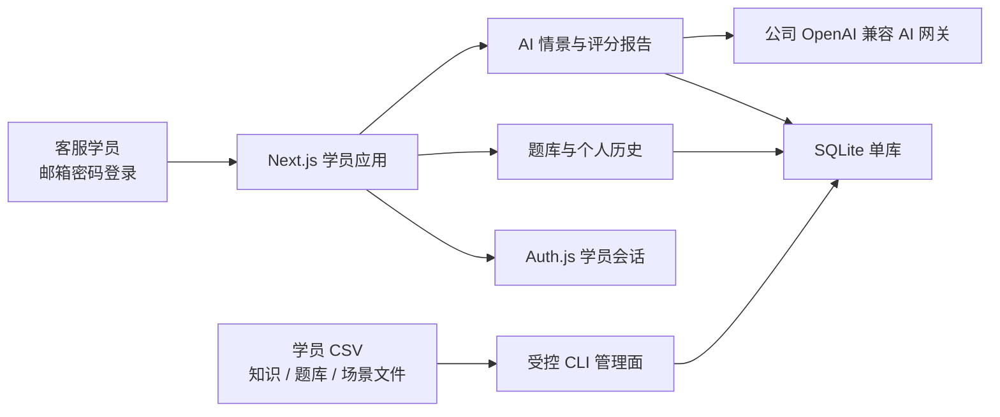

# 学员轻量版与 SQLite 改造设计

日期：2026-08-10

## 1. 背景与结论

当前生产基线是根目录的 Next.js 单体应用，使用 Auth.js Credentials、Drizzle 和 Neon PostgreSQL。仓库中的 `backend/`、`frontend/` 与 `deploy/` 是已回退的公司技术栈迁移代码，不属于当前运行时。

本轮不再做前后端框架重构。目标是保留现有学员体验、领域服务和公司 OpenAI 兼容 AI 网关，将运行时收敛为学员单角色应用，并用本地 SQLite 文件替换 Neon PostgreSQL。正式服务器、域名、进程守护和定时备份属于后续部署阶段。

首版目标规模为 100 个学员账号、约 30 人同时在线。

## 2. 产品范围

### 2.1 保留能力

- 邮箱和密码登录。
- 专题练习与正式题库。
- AI 情景训练、刷新恢复和评分报告。
- 学员个人练习历史与进度。
- 公司 OpenAI 兼容 AI 网关。
- 通过文件和命令维护账号、知识、题库和场景。

### 2.2 退出活跃运行时

- `/admin/**` 页面、Server Actions 和管理员路由分支。
- 任务分配、题目人工审核、场景网页管理、训练报告人工复核和知识健康管理页面。
- Neon Serverless 驱动、PostgreSQL schema 和 PostgreSQL 迁移链路。
- 管理员角色、`requireAdmin` 及管理员登录后重定向。

管理端完整代码在改造开始前通过 `archive/full-app-before-learner-lite-20260810` Git 标签保存，并新增归档说明，记录标签、原模块和恢复方式。标签必须同步到 `origin` 和 `gitea`。归档后从活跃代码树删除管理端，不复制到 `archive/` 目录。

## 3. 目标架构

页面继续通过领域服务和 Store/Provider 接口访问能力，不直接操作数据库或模型客户端。`src/lib/runtime/services.ts` 仍是组合根，但运行时只组合 SQLite Store 和公司 AI Provider，不再保留 PostgreSQL/SQLite 双栈。

未来接入飞书 OAuth 时，只替换认证 Provider 并增加企业身份映射；训练服务、学员 ID 和历史数据接口保持稳定。

## 4. SQLite 数据设计

### 4.1 保留的表组

身份与内容：

- `users`：仅保存学员账号。
- `knowledge_versions`、`knowledge_sources`、`knowledge_units`。
- `quiz_sets`、`questions`、`quiz_set_questions`。
- `scenarios`、`scenario_versions`。

训练与历史：

- `quiz_attempts`、`quiz_answers`。
- `topic_quiz_attempts`、`topic_quiz_answers`。
- `training_sessions`、`training_messages`。
- `evaluation_reports`。

### 4.2 删除或简化的关系

- 删除 `assignments`、`question_reviews`、`review_decisions`。
- 删除答题和情景会话对 `assignment_id` 的引用。
- 删除报告的人工复核状态、触发原因和复核关系。
- 内容发布不再依赖管理员用户外键，改为记录 CLI 来源、内容版本与发布时间。
- 将当前混合管理写入和学员读取的 `QuizReviewStore` 拆开：学员端只保留已发布题组读取接口，题库构建与发布改由 CLI 专用服务负责。

350 道专题练习题继续以当前代码文件为内容源，专题答题记录保存到 SQLite。正式题库、知识版本和场景模板保存到 SQLite。

### 4.3 类型映射

| PostgreSQL | SQLite |
| --- | --- |
| UUID | 应用生成的 `TEXT` 主键，迁移时保留原 ID |
| `jsonb` | Drizzle JSON 文本字段 |
| `pgEnum` | `TEXT` 与 `CHECK` 约束 |
| `timestamptz` | 毫秒时间戳 `INTEGER` |
| `numeric` | `REAL` |
| `boolean` | SQLite integer boolean 映射 |

数据库连接启动时强制启用外键约束、WAL 和 5 秒 busy timeout。数据库路径由 `SQLITE_PATH` 显式提供；生产模式下文件不可写、schema 版本不匹配或完整性检查失败时直接停止启动，禁止静默回退到 JSON 或内存存储。

## 5. 账号与内容运维

### 5.1 学员账号

第一阶段通过 CSV 和 CLI 维护学员账号，不开放自助注册：

- 幂等导入或更新学员姓名、邮箱和启用状态。
- 停用离职或无权使用的账号。
- 生成或重置 bcrypt 密码。
- 不允许导入管理员角色。

CLI 输出成功、跳过、停用和失败数量，不打印明文密码或密码哈希。未来飞书 OAuth 接入后，CSV 账号作为过渡身份来源退出。

### 5.2 内容发布

知识、正式题库和场景继续由 Markdown、Excel 或项目定义文件产生。发布命令先执行 schema、来源、内容哈希和引用校验，再在单个 SQLite 事务中写入不可变版本并切换活动指针。校验或写入失败时整批回滚。

## 6. Neon 基础数据迁移

迁移只读取 Neon，不修改原数据库：

1. 导出有效学员账号、活动知识版本及来源、已发布正式题组和题目、已发布场景版本。
2. 生成带 `schemaVersion`、导出时间、表级数量和 SHA-256 的版本化 JSON Bundle。
3. 初始化空 SQLite schema，并在单事务中导入 Bundle。
4. 对比账号、内容数量、活动版本、外键和内容哈希。
5. 使用迁移后的密码哈希完成登录验证。

任务、答题记录、对话消息、评分报告和人工复核记录不迁移。导入器必须验证这些历史表在新库中为空。

## 7. 并发与失败处理

- 目标运行形态是单个 Next.js 进程和一个持久 SQLite 文件，不支持多个应用实例同时挂载同一文件。
- 使用 Drizzle 与 `better-sqlite3`；所有写事务保持短小。
- AI 请求在数据库事务之外执行，只在收到顾客回复、风险结果或最终报告后写入短事务。
- 答题、消息和报告使用业务 ID、消息位置及唯一约束保证幂等。
- `SQLITE_BUSY` 进行有限重试；重试耗尽后返回可安全重试的中文错误，不暴露数据库路径或内部 SQL。
- 进程重启后，已完成数据和未完成情景会话必须能够恢复。
- 提供 schema 版本检查、SQLite 完整性检查、版本化导出和手工备份命令。定时备份频率在部署设计中确定。
- 首版不自动清理历史；学员只能读取自己的答题、对话和报告。

## 8. 验收标准

### 8.1 自动化与功能

- lint、类型检查、单元测试、SQLite migration 检查和 Next.js 生产构建通过。
- 登录只接受有效学员；首页和登录后入口统一进入 `/practice`；`/admin/**` 不再存在。
- 专题练习、正式题库、服务端判分、个人历史和跨用户隔离通过测试。
- AI 情景完成三轮对话、刷新恢复、报告生成和历史读取；公司 AI 网关执行独立真实冒烟。
- CSV 账号导入、停用和密码重置支持重复执行且结果一致。
- 知识、题库和场景发布支持版本校验、幂等执行和事务回滚。

### 8.2 数据迁移

- 基础账号、活动知识、正式题库和场景数量与哈希对账一致。
- 原密码哈希可继续验证，且迁移产物不包含明文凭据。
- 新 SQLite 不包含旧任务、答题、对话、报告和复核流水。

### 8.3 并发与恢复

- 使用 Mock AI 模拟 30 个并发学员，持续 10 分钟覆盖登录读取、答题写入、消息追加、报告保存和历史查询。
- 压测期间锁错误、丢写、重复消息、重复成绩和外键损坏均为 0。
- 进程重启后数据完整，未完成情景可继续。
- 不可写路径、损坏文件和迁移版本不兼容均明确失败，不发生静默降级。

## 9. 后续阶段

本设计不决定服务器供应商、域名、备案、TLS、反向代理、进程守护、定时备份和正式发布流程。部署阶段必须选择带持久磁盘的单实例 Node.js 运行环境；Vercel 式无状态函数不能把本地 SQLite 文件作为生产持久数据库。

部署形态确定后，再补充备份频率、恢复演练、监控告警和升级到服务型数据库的触发阈值。

## 10. 技术依据

- [Drizzle ORM：SQLite](https://orm.drizzle.team/docs/sqlite/get-started-sqlite)：Drizzle 原生支持 `better-sqlite3` 等 SQLite 驱动。
- [Next.js：Self-Hosting](https://nextjs.org/docs/app/guides/self-hosting)：单个带持久磁盘的 `next start` 实例可自托管完整 Next.js 能力。
- [Vercel：Functions 中的文件](https://vercel.com/kb/guide/how-can-i-use-files-in-serverless-functions)：函数写入需要外部持久存储，不能将本地函数文件系统作为 SQLite 生产存储。
