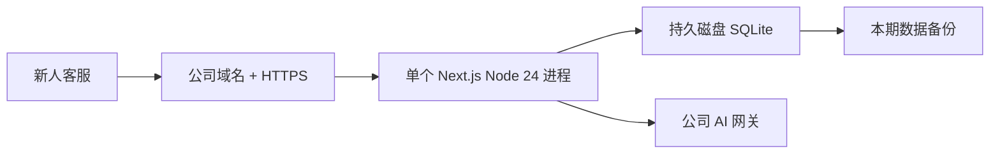

# AI 客服训练 MVP 技术交接

最后更新：2026-08-11

## 先说结论

项目当前已经是一个能演示、接近能试用的新人客服培训 MVP。

如果使用场景是一批新人培训一周到一个月，当前功能基本够用：学员登录、刷题、AI 模拟接待、报告和个人历史都已经实现。接下来不需要先做大规模重构，最重要的是找到一台能持久保存 SQLite、能访问公司 AI 网关的机器，完成一次真实部署验收。

飞书 OAuth、网页管理后台、PostgreSQL、高可用和多实例都可以后做，不应阻塞第一批试用。

## 当前项目是什么

当前真正运行的是仓库根目录的 Next.js 应用：

```text
Next.js 16 + React 19 + TypeScript
Auth.js Credentials
Drizzle ORM + SQLite
OpenAI 兼容 AI 网关 / Mock AI
Vitest + Playwright
```

`backend/`、`frontend/`、`deploy/` 是此前 Vue/FastAPI 迁移尝试留下的历史代码，不是当前生产入口。不要根据这些目录判断现在的启动命令或部署架构。

## 当前已经可以使用的功能

- 邮箱密码登录、停用账号和重置密码；
- 专题练习、正式题、服务端判分；
- 不同学员的记录隔离；
- AI 或 Mock 情景对话；
- 会话刷新恢复、风险提示、结束训练和评分报告；
- 学员查看自己的答题和情景历史；
- CLI 导入账号、发布知识、题库和场景；
- SQLite 完整性、外键和 Schema 启动检查；
- 数据库备份命令。

当前没有主管网页后台、任务分配、团队统计和人工复核。这对短周期自助培训不是阻断项；如果业务明确需要这些能力，再单独排期。

## 当前线上状态

Vercel 演示地址：<https://ai-customer-service-training.vercel.app/login>

当前 Vercel 使用 `DEMO_MODE=true` 和 `SCENARIO_AI_MODE=mock`：

- 可以直接进入固定的“演示学员”；
- AI 回复和报告来自 Mock；
- 数据只存在当前函数实例的内存 SQLite 中；
- 冷启动或重新部署后数据会重置。

因此 Vercel 当前只是产品演示，不是正式新人培训环境。

## AI 网关现状

本地 `localhost` 访问公司 OpenAI 兼容网关可以正常完成真实 AI 请求。项目此前的实测中，Vercel `hkg1` 函数访问同一网关会超时，原因是该接口依赖公司网络或 VPN，Vercel 不在这条网络路径内。

代码侧已经具备真实 AI 调用、连续对话、刷新恢复、报告生成、超时错误脱敏和 Mock 降级能力。尚未完成的是“部署环境到公司网关的网络打通”。

正式试用前，在目标服务器上完成下面四步即可作为最小 AI 验收：

1. 用真实学员账号开始一个情景；
2. 连续完成至少三轮真实 AI 对话；
3. 刷新页面，确认上下文仍在；
4. 结束训练并生成真实 AI 报告。

如果部署时暂时只能使用 Mock，页面和培训通知中必须说清楚，Mock 分数不能当成绩使用。

## 推荐部署方案

### 首选：公司网络内单实例

建议使用一台公司 Linux 服务器或固定主机：



原因很简单：它最符合现有代码，不需要迁移数据库，也更容易接入公司 AI 网关。

部署时至少做到：

- 使用 Node.js 24.x、pnpm 10+；
- `SQLITE_PATH` 指向持久、可写的磁盘文件；
- 正式环境设置 `DEMO_MODE=false`；
- 配置至少 32 位随机 `AUTH_SECRET`；
- 通过 HTTPS 对外提供访问；
- 使用 systemd、PM2 或同类工具守护单个 Node 进程；
- 每日或每期执行一次 SQLite 备份；
- 确认服务器能直接访问 AI 网关；
- 部署后重新运行完整检查和真实 AI 验收。

### 如果继续使用 Vercel

Vercel 可以继续展示产品，但当前架构不适合直接在 Vercel 保存正式数据。若一定要长期用 Vercel，需要把 SQLite 改成 Vercel 可访问的托管数据库，并另外解决公司 AI 网关的公网或私网连接。这比公司内网单机方案改造更多，不建议作为第一批 MVP 的首选。

## 飞书 OAuth 后续怎么接

飞书 OAuth 不是当前 MVP 的必需项。第一批培训可以继续使用批量导入的邮箱密码账号；部署和 AI 稳定后再接飞书，风险更小。

接入时建议只把飞书当作登录入口：

1. 用户从飞书工作台打开应用；
2. 服务端接收授权码并换取用户身份；
3. 飞书身份绑定到项目现有的内部 `user.id`；
4. 答题、对话和报告继续使用内部 `user.id` 关联；
5. 员工停用或离职时，同步停用项目账号。

不要直接把邮箱当永久身份。当前 `users.passwordHash` 是必填字段，接飞书前建议新增独立身份表：

```text
auth_identities
- user_id
- provider
- provider_subject
- tenant_key
- last_login_at
```

`provider_subject` 最终使用飞书的 `open_id`、`union_id`、`user_id` 还是公司统一 SSO subject，需要技术人员结合应用类型和租户范围确认。App Secret、OAuth token 和 `AUTH_SECRET` 都只能放在服务端环境变量中。

飞书的应用可见范围只决定谁能看到入口，不等于项目内权限；以后如果增加主管角色，仍要在项目内部实现角色和数据范围判断。

## 本轮验证结果

### 已通过

- `pnpm check`
  - ESLint 通过；
  - TypeScript 通过；
  - Vitest：64 个文件、191 个测试通过；
  - Drizzle migration check 通过；
  - Next.js production build 通过。
- `pnpm test:e2e`
  - 3 个 Mock 浏览器测试通过；
  - 覆盖正常登录、停用账号、跨学员隔离、三轮情景、刷新恢复和报告生成。
- `pnpm e2e:prepare && pnpm test:sqlite:concurrency`
  - 30 workers、1500 条并发写入通过；
  - 无锁失败、重复记录或外键损坏。

### 验证边界

- 本轮本机是 Node.js 26.6.0，项目声明 Node.js 24.x；正式服务器需要在 Node.js 24 重新验证。
- 并发测试约 3 秒，只能证明短时 SQLite 写入没有立即出错，不等于长期压测。
- 本轮没有重新运行真实 AI E2E，没有产生公司模型调用。
- `pnpm audit --prod --audit-level moderate` 当前报告 7 个 high、3 个 moderate 依赖告警，主要来自 Next 和 Excel 处理依赖链。第一批内网受控试点可先由技术人员评估实际暴露面，但正式开放到公网前应完成升级或风险确认。

## 已知问题怎么理解

### 第一批真实试用前要解决

- [ ] 正式环境不能使用内存演示数据库；必须配置持久 `SQLITE_PATH`。
- [ ] 目标服务器必须能访问公司 AI 网关，或明确本期只使用 Mock。
- [ ] 配置正式域名、HTTPS、进程守护和 `AUTH_SECRET`。
- [ ] 至少完成一次备份，并确认备份文件可以重新打开。
- [ ] 使用 Node.js 24 重新运行 `pnpm check` 和 Mock E2E。
- [ ] 在部署环境完成三轮真实 AI 和报告验收。

### 可以后续再做

- 飞书 OAuth 和组织同步；
- 网页管理后台、主管任务和团队统计；
- PostgreSQL、多实例和高可用；
- 完整监控平台和长期容量规划；
- 更细的登录限流、会话即时撤销和审计查询；
- 长时间混合负载测试。

“可以后做”不代表永远不做，而是这些工作不应阻塞短周期、有人看护的新人培训 MVP。

## 技术接手时需要决定的五件事

1. 部署在现有哪台公司服务器，谁负责维护；
2. 服务器能否直接访问公司 AI 网关；
3. 正式域名和 HTTPS 由谁配置；
4. 每期培训数据保留多久，备份放在哪里；
5. 飞书 OAuth 计划使用哪个稳定用户标识绑定内部账号。

## 主要代码与文档位置

| 要修改什么 | 先看哪里 |
|---|---|
| 登录、会话、演示入口 | `src/auth.ts`、`src/lib/auth/`、`src/app/login/` |
| SQLite 和数据表 | `src/db/client.ts`、`src/db/schema.ts`、`drizzle/` |
| 题库与判分 | `src/lib/quiz/`、`src/app/practice/quiz/` |
| AI 对话与报告 | `src/lib/scenario/`、`src/app/practice/scenario/` |
| 账号和内容维护 | `scripts/` |
| 环境变量 | `.env.example`、`src/lib/runtime/env.ts` |
| 部署细节 | `docs/DEPLOYMENT.md` |

注意：`docs/MVP-ACCEPTANCE.md` 仍包含旧 Neon 和历史管理员版本信息，不应作为当前学员 SQLite MVP 的部署依据。

## 建议交付顺序

1. 先按公司内网单实例部署；
2. 跑 Mock E2E，确认登录、题库和数据持久化；
3. 打通公司 AI 网关并做真实 AI 验收；
4. 找少量新人试用一个培训周期；
5. 根据实际反馈再决定是否接飞书 OAuth、补主管后台或迁移数据库。
